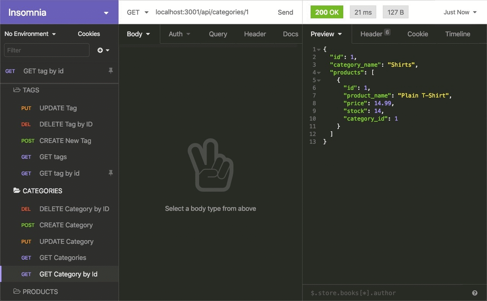

# E-Commence

## Description

I have build the back end for an e-commerce site. Because this application won’t be deployed, you’ll also need to provide a link to a walkthrough video that demonstrates its functionality and all of the acceptance criteria being met. You’ll need to submit a link to the video.

## Technologies used

- **Express.js** - A web application framework for Node.js. It is a framework for building web applications using Node.js, and is designed for building RESTful web applications.

- **My Sequelize** - A Node.js ORM for PostgreSQL. It is a tool for building database-driven applications with Node.js. It is a tool for building database-driven applications with Node.js.

- **MySQL** - A relational database management system. It is a database server that runs on a computer and manages a database. It is a relational database management system.

- **Node.js** - A JavaScript runtime environment that is used to execute JavaScript code outside of a browser. It is a JavaScript runtime environment that is used to execute JavaScript code outside of a browser.

- **Insomnia** - A tool for testing your Node.js applications. It is a tool for testing your Node.js applications.

## Functionality of the application

```md
GIVEN a functional Express.js API
WHEN I add my database name, MySQL username, and MySQL password to an environment variable file
THEN I am able to connect to a database using Sequelize

WHEN I enter schema and seed commands
THEN a development database is created and is seeded with test data

WHEN I enter the command to invoke the application
THEN my server is started and the Sequelize models are synced to the MySQL database

WHEN I open API GET routes in Insomnia for categories, products, or tags
THEN the data for each of these routes is displayed in a formatted JSON

WHEN I test API POST, PUT, and DELETE routes in Insomnia
THEN I am able to successfully create, update, and delete data in my database
```

I will develop the app using the following working Express.js API to use Sequelize to interact with a MySQL database.

Because this application won’t be deployed, you’ll also need to provide a link to a walkthrough video that demonstrates its functionality and all of the acceptance criteria being met. You’ll need to submit a link to the video and add it to the readme of your project.

## Screenshots of app functionality


The following animation shows the application's GET routes to return a single category, a single product, and a single tag being tested in Insomnia:



The following animation shows the application's POST, PUT, and DELETE routes for categories being tested in Insomnia:


## Walk through video

https://drive.google.com/file/d/1JYzPrDqlPFIh8Fk4oBg-mWrJYPdnRYGg/view?usp=sharing

## What is the usage of this program?

Storing data for the company’s products and stock check

## Who contributed toward your project?

Special thanks to Bootcamp, Tom, Rhys, Sara and bootcam materials (and Google)

## Links

**<ins>GitHub</ins>** - https://github.com/jtiwana-git/E-Commence#readme
